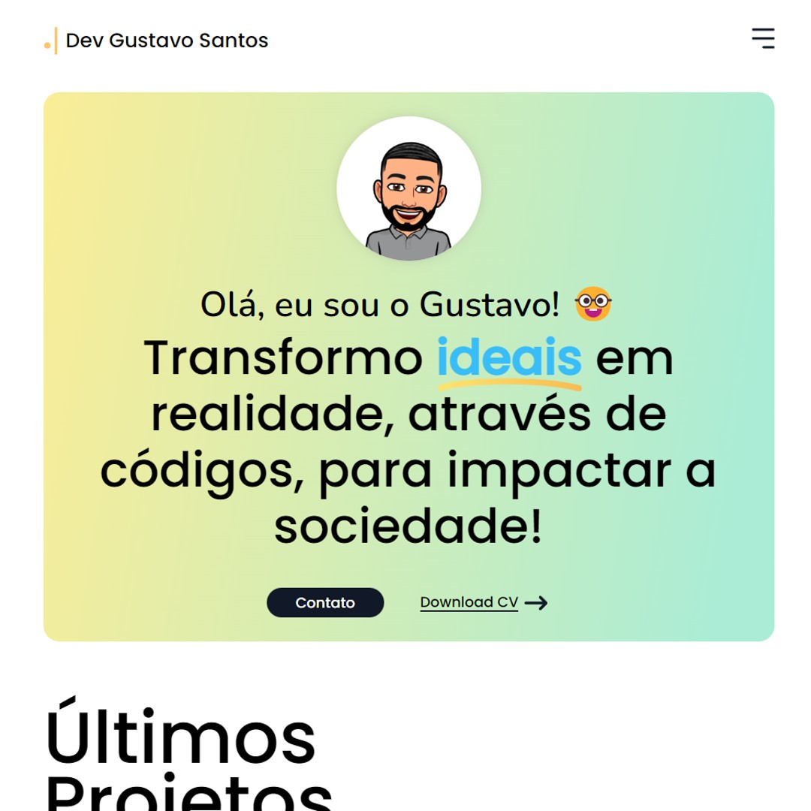

# :technologist: Meu Portfólio

Esse repositório é responsável por hospedar meu portfólio .

<h1 align="center">
    
</h1>

## :open_book: Sumário

-   [Pré-Visualização](#clapper-pré-visualização)
-   [Aviso](#loudspeaker-aviso)
-   [Sobre](#memo-sobre)
-   [Tecnologias](#floppy_disk-tecnologias)
-   [Autor](#nerd_face-autor)

 

## :clapper: Pré-Visualização

<h1 align="center">
    
</h1>

<h1 align="center">
    
</h1>

 

## :loudspeaker: Aviso

-   Agradecimentos especiais á Rafael Jr, que fez o layout, e você pode encontra-lo [clicando aqui!](https://www.figma.com/community/file/1126581136185110141)

 

## :memo: Sobre

Este projeto é apenas um página simples que apresenta alguns dos meus projetos que fiz, e nessa página resolvi utilizar o pré-processador SASS para treinar alguns conceitos.

Você pode visitar a página [clicando aqui!](https://devgustavosantos.github.io/)

 

## :floppy_disk: Tecnologias

-   **HTML** - utilizado para fazer a marcação do conteúdo;
-   **SASS** - utilizado para gerar o CSS;
-   **JS** - usado para fazer toda a lógica da interatividade;
-   **Git** - responsável por realizar o versionamento do código.

 

## :nerd_face: Autor

Feito com :heart: por Dev Gustavo Santos :grinning: Veja meu [LinkedIn.](https://www.linkedin.com/in/devgustavosantos/)
